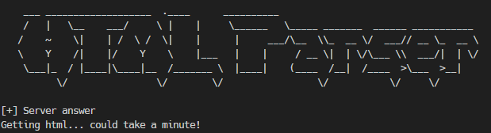

<h1 align="center">😈 HTML Parser</h1>

 </img>

This Rust-based HTML parser provides a powerful and flexible tool for extracting information from web pages and resolving associated IP addresses. With a sleek command-line interface, it's designed for simplicity and efficiency.

## 🔑 Features

- **Randomized IP Spoofing**: Utilizes random IP addresses for web requests to enhance anonymity.
- **User-Agent Rotation**: Employs fake User-Agents for each request, adding an extra layer of disguise.
- **DNS Resolution**: Resolves domain names to IP addresses using the Trust-DNS Resolver library.
- **HTML Parsing**: Extracts hyperlinks from HTML documents, enabling efficient link analysis.
- **Output to File**: Saves resolved IP addresses with associated URLs to a customizable output file.

## 🏎️ Usage  

1. Download the releases [here for your respective OS](https://github.com/at0mic-l1mbo/html_parser/releases/tag/htmlparser)
2. Then run `.\html_parser https://www.somewebsite.com`  

## 📫 Contributions  

Contributions are welcome! Feel free to open issues, submit pull requests, or provide feedback. Together, we can make this project even better.  

## 📝 License

This project is licensed under the MIT License - see the [LICENSE](LICENSE) file for details.  

## Building this project from sourcefile

### Commands
1. Clone the repository: `git clone https://github.com/yourusername/your-repo.git`
2. Navigate to the project directory: `cd your-repo`
3. Build and run: `cargo run -- https://www.example.com`

### Getting Started

1. Install Rust and Cargo by following the [official Rust installation guide](https://www.rust-lang.org/tools/install).
2. Add dependencies to your `Cargo.toml`.
3. Customize the code and configuration as needed for your specific use case.
4. Run the application and explore the results in the `index.txt` file.
   
### Requirements
- Rust
- Cargo
- Trust-DNS Resolver
- Reqwest

## 🦄 Author

<table>
  <tr>
    <td align="center">
      <a href="#" title="author image">
         
        
          <b>At0mic-l1mbo</b>
        
      </a>
    </td>
  </tr>
</table>
